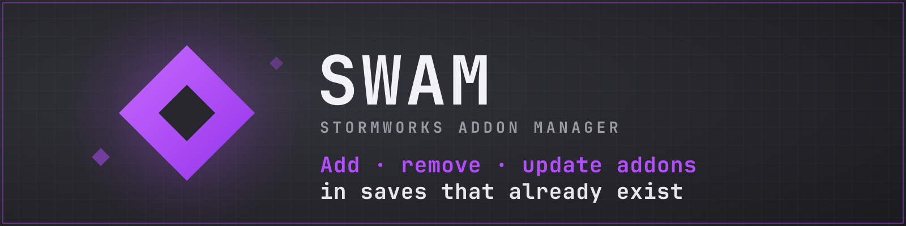
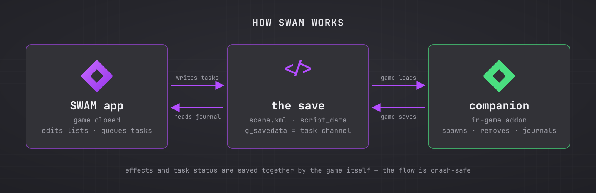

# SWAM - Stormworks Addon Manager


Add, remove, update and generally manage **addons and mods in your existing
Stormworks: Build and Rescue saves** - the thing the game itself never lets
you do after a world is created. Works on **Windows** and **Linux / Steam Deck** (Proton).

> ⚠️ **Work in progress.** SWAM already works well (the full
> add → play → remove cycle has been verified to restore a real save
> byte-for-byte), but expect rough edges. Back up anything you love.
> SWAM makes its own backups before every change, too.


> ## About AI and accusations
> English is not my native language, so this README was written with AI assistance.
> The entire project logic, architecture, and code were written by me. AI was used **afterwards** only for English text, comments, and readability improvements. I wanted the code to be very understandable and readable.
> After a wave of accusations, "AI slop" claims, and demands to remove any trace of AI, I stripped out **all** comments and formatting. The code now ships in a raw, minified state. It works perfectly - that's what matters.
> If you're here just to complain about AI readme or question the authenticity of the project - **go fuck yourself**. I have zero interest in arguing with your biases. The tool solves a real problem and actually works.
---


## What it can do

- **Attach and detach mods** (meshes, tiles, shaders) - takes effect on the
  next game launch, no world reload logic needed.
- **Attach addons** (missions, zones, structures, scripted logic) to a save
  that already exists - including spawning their buildings and cranes on
  the map, which the game only does at world creation.
- **Detach addons cleanly** - the structures and objects they spawned are
  removed from the world, not just the menu entry.
- **Update addons** to their newest workshop version: old structures out,
  new ones in, one world load. Works for hand-edited local copies too:
  change an addon's files in `data/missions` and SWAM notices, then
  refreshes the world from your edited version on request (or puts the
  workshop version back, if you'd rather drop the edits).
- **Edit addon settings** - the same sliders and checkboxes the game shows
  at world creation, but for a world that already exists. Works because the
  game never stores those values itself: scripts read the defaults from
  their own text on every load and snapshot some of them into the save.
  SWAM edits both.
- **Apply your own edits to an addon** - move one of its buildings, delete
  one, change a spawn point. Edit the files in `data/missions`, then
  `refresh`: the old structures come out and the world is rebuilt from your
  version. SWAM keeps a copy of each addon's playlist as it was when the
  structures were spawned, so your edits do not blind it.
- **Remove built-in (vanilla) addons**, the way you would any other, which
  is what you want when you are replacing one with a workshop version.
- **Keep you safe**: every operation makes a backup first, rolls back on
  failure, refuses to run while the game is open, and an integrity check
  (`verify`) can audit everything afterwards.

## What it honestly cannot do

- Addons that initialize **only** at world creation
  (`if is_world_create ...` with no fallback) may misbehave when added to
  an old save. SWAM inspects the script and warns you when it detects that
  pattern.
- Addons that were already in the save before SWAM ("inherited") have no
  ownership records anywhere - removing *their* structures uses careful
  coordinate matching (spawn-point positions with a small physics
  tolerance, only on vehicles and objects the game itself marks as
  addon-spawned, and never on anything the companion's journal attributes
  to a different addon),
  which covers placed buildings but not things their scripts spawned in
  the past. For those there is a manual fallback: stand next to the
  structure in game, type `?swam mark` in chat, save - and SWAM removes it
  (and, optionally, every identical copy on the map).
- Coordinate matching cannot tell apart identical structures that sit at
  the same spot on *different* tiles: a spawn point is recorded relative to
  its tile, and the map reuses tiles. When that happens SWAM says so and
  leaves them alone rather than guess. In practice this only shows up on a
  few vanilla addons.
- Addon settings that a script never stores in the save can only be changed
  for *every* save using that copy of the addon, not for one world. The
  game keeps no per-save record of them, so there is nothing to edit.
  SWAM labels which is which.
- Indirect traces (money you earned from an addon's missions, loot you
  picked up) stay. SWAM is a manager, not a time machine.

---

## Installation

### Windows - the easy way (no terminal, nothing to install)

1. Open the [Releases](../../releases) page.
2. Download **`SWAM.exe`**.
3. Double-click it. That's the whole installation.

Windows SmartScreen may warn about an unknown publisher the first time -
that's normal for small open-source tools; choose "More info → Run anyway".

### Windows / Linux - from source

You need Python 3.10+ (on Windows: [python.org](https://python.org), check
"Add to PATH" during setup; on Linux you already have it - just make sure
the Tk package is installed, e.g. `sudo pacman -S tk` or
`sudo apt install python3-tk`).

```sh
git clone https://github.com/FoxlikeCreature/SWAM-Stormworks-Addon-Manager.git
cd SWAM-Stormworks-Addon-Manager
python -m swam gui
```

No third-party Python packages are required at all - the standard library
is enough.

---

## Using the GUI


1. **Close Stormworks.** SWAM refuses to touch saves while the game runs
   (your edits would be overwritten), so this is not optional.
2. Launch SWAM. Pick your save in the dropdown at the top.
3. You'll see everything attached to that save: mods, addons (including
   the ones the game attached straight from the workshop folder), and the
   built-in vanilla addons (violet-tinted). Colored rows mean something:
   green = SWAM's companion, amber = an update is available.
4. **Install the companion** (one button, once per save). It's a tiny
   in-game addon that acts as SWAM's agent: it records who spawned what and
   does the actual spawning/removal inside the game. Without it, adding an
   addon only registers it - buildings won't appear.
   Even better: [subscribe to the companion on the workshop](https://steamcommunity.com/sharedfiles/filedetails/?id=3761466847)
   and enable it when **creating** new worlds - then its journal covers
   your world from day one, and SWAM recognizes it automatically.
5. **Add addon…** opens a visual catalog: your workshop subscriptions,
   local files and built-in content on separate tabs, with thumbnails.
   Click a tile, or type in the search box; the box also accepts a raw
   workshop id or a folder path.


6. After adding or removing an addon with structures, SWAM will tell you:
   **load the save once**, wait a couple of seconds for the chat message
   `[SWAM] tasks done`, then **save the game**. That's when the world
   actually changes.
7. **Remove selected** / **Upgrade selected** do what they say, with
   appropriately worded warnings where you're about to do something you
   shouldn't.
8. **Settings…** opens the addon's world-creation sliders and checkboxes
   for the selected addon. Values marked *per-save* live in this save;
   values marked *default* live in the addon's local files and are read
   fresh on every world load (by every save using that copy). Changes
   apply from the next world load.
9. **Refresh from files** is for editing an addon yourself: move one of its
   buildings, delete one, change a spawn point. Edit
   `data/missions/<addon>`, press the button, load the world. **Clean
   leftovers…** is for buildings still standing after an addon you already
   removed.
10. **Help** explains every button and walks through the usual jobs
   (adding and removing mods and addons, updating from the workshop,
   applying your own edits, replacing a vanilla addon with a workshop one).
11. **Remove marked…** is the manual fallback for structures nothing else
   can attribute: in game, stand next to the offending structure, type
   `?swam mark` in chat, save the game, close it - then click the button.
   SWAM removes the marked structure and (optionally) every identical
   copy of it on the map. Player-built vehicles are never touched: SWAM
   only accepts vehicles the game itself marked as addon-spawned, with no
   author list. Chat commands: `?swam` (status, anyone), `?swam mark` and
   `?swam unmark` (admins only, so nobody can mark the server's buildings
   for deletion on a multiplayer world).

## Using the CLI

Everything the GUI does, scriptable:

```sh
swam saves                          # list saves
swam list <save>                    # what's attached
swam status <save>                  # managed addons + update check + verify
swam manage <save>                  # interactive text mode

swam install-companion <save>       # once per save
swam add-addon <save> <id|path|name>
swam remove-addon <save> <name>     # --force for inherited addons,
                                    # --force-geometry to also remove their statics
swam upgrade-addon <save> <name>    # refresh from workshop, or with
                                    # --local from your edited files in
                                    # data/missions (--discard-local
                                    # restores the workshop version)
swam settings <save> <name>         # view addon settings
swam settings <save> <name> --set "Label=value"   # change them
swam refresh <save> <name>          # you edited the addon's files by hand:
                                    # rebuild its structures from your version
swam cleanup <save> <name>          # despawn an addon's leftover structures
                                    # (works even after the addon was removed)
swam remove-marked <save> [--all]   # despawn structures marked in game
                                    # with "?swam mark"
swam add-mod <save> <id|path>
swam remove-mod <save> <id>
swam journal <save>                 # what the companion has recorded
swam verify <save>                  # integrity audit
```

Every mutating command - including `restore` and `settings` - accepts
`--dry-run` (show what would happen, change nothing) and `--no-backup`.
Installed as a package, the same commands are available as `swam …`;
from a clone, use `python -m swam …`.

Backups live in `~/.local/share/swam/backups/`
(`%LOCALAPPDATA%\swam\backups` on Windows): the last 5 per save, plus up
to 3 "pre-restore" ones kept on their own quota so that rolling back
never evicts your ordinary backups. The backup you restore *from* is
never pruned.
If your game lives somewhere unusual, point `SWAM_SW_ROOT` at the folder
containing `saves` and `data`; `SWAM_DATA_DIR` moves SWAM's own backups
and lock files somewhere else.

---

## How it works?

Stormworks stores each save as a folder of mostly-readable files. The game
loads them honestly on every launch - it just never offers UI to change
the addon list after world creation. SWAM fills that gap with three
cooperating parts:



### 1. The CLI/GUI (outside the game)

A save's `scene.xml` contains three lists that matter:

- `<active_mods>` - attached mods (plain list, no state);
- `<active_playlists>` - every attached addon;
- `<scripts>` - addons that have a Lua script, each with a `script_id`
  number binding it to its persistent state file
  (`script_data/<id>.xml` = the addon's serialized `g_savedata`).

SWAM edits these lists while the game is closed. Notably, `scene.xml`
**cannot be parsed by standard XML libraries** - the game writes attributes
with digit-leading names like `<initial_transform 30="..."/>`, which is
invalid XML. So SWAM performs anchored text surgery instead: every edit
targets an anchor that must occur exactly once, tag balance is verified
before writing, and any ambiguity means refusal, not guessing.

Two hard-won rules are baked in:

- **`script_id`s are never renumbered.** Each number binds an addon to its
  saved state; the game happily tolerates and preserves gaps in the
  numbering (verified experimentally), so removal simply leaves a hole.
- **Nothing is written while the game runs** - the game rewrites the whole
  save when it saves, so concurrent edits would be lost silently.

### 2. The companion addon (inside the game)


Some things can only be done by the game itself: an addon added to an
existing save never spawns its structures (that happens only at world
creation), and the save stores **no record of which addon spawned which
vehicle** - nothing to base clean removal on.

The companion is a small Lua addon SWAM installs into the save. It does
two jobs:

- **Provenance journal.** The engine fires an event
  (`onSpawnAddonComponent`) every time any addon spawns something, and it
  names the addon. The companion records `addon name → spawned ids` in its
  own persistent state. From that moment SWAM *knows* what belongs to
  whom - including things spawned by other addons' scripts at runtime.
- **Task execution.** Spawning a newly added addon's locations on their
  home tiles, and despawning recorded entities of a removed one - using
  the engine's own spawn/despawn calls rather than file surgery, because
  vehicle files in the save are an opaque binary format.

### 3. The channel between them

There is no socket and no shared file protocol - the trick is that the
companion's own state file **is** the channel. The CLI writes tasks
directly into `script_data/<id>.xml`; on load the game deserializes that
into the companion's `g_savedata`; the companion executes the tasks and
writes reports into the same structure; saving the game persists it all
back to disk, where the CLI reads the results. Task effects and task
status are saved atomically together by the game itself, which makes the
whole flow crash-safe: if you quit without saving, both the effect and the
"done" mark vanish together, and the task simply re-runs next time.

### The lock file

`~/.local/share/swam/locks/<save>.json`
(`%LOCALAPPDATA%\swam\locks` on Windows) records what SWAM itself
installed: source, content hash, script id. That's how it distinguishes
addons it manages (fully guaranteed clean removal) from inherited ones
(best-effort, with explicit `--force` consent), and how `status` knows an
update is available - it compares the content digest of your local copy
against the subscribed workshop version.

### The playlist snapshots

`~/.local/share/swam/world/<save>/<addon>.xml` is a copy of each attached
addon's playlist as it was when its structures went into the world. It
exists so that your own edits to an addon do not blind SWAM: the structures
standing in the world sit at the *old* coordinates, so that is the version
it has to match them against. Without it you would have to edit the files
after asking for a refresh rather than before, which is backwards.

### Verified against the real thing

The design isn't theoretical: the format behaviors above (the
`is_world_create` semantics, script_id gap tolerance, the provenance
event, structure spawning on home tiles) were each established by
experiments on real saves, and the full cycle - add an addon, watch 50
vehicles appear, remove it, get a world byte-identical to the original -
has been performed on a live career-style save. The g_savedata codec
round-trips all 210 state files found on the development machine, and CI
runs the core test suite on Windows to keep both platforms honest.

---

## Building the Windows exe yourself

```sh
pip install pyinstaller
pyinstaller --onefile --windowed --name SWAM \
  --add-data "swam/companion;swam/companion" --paths . scripts/gui_entry.py
```

Or just push a `v*` tag - GitHub Actions builds and attaches the exe to
the release automatically.

## License

MIT. Not affiliated with Geometa (the developers of Stormworks).
